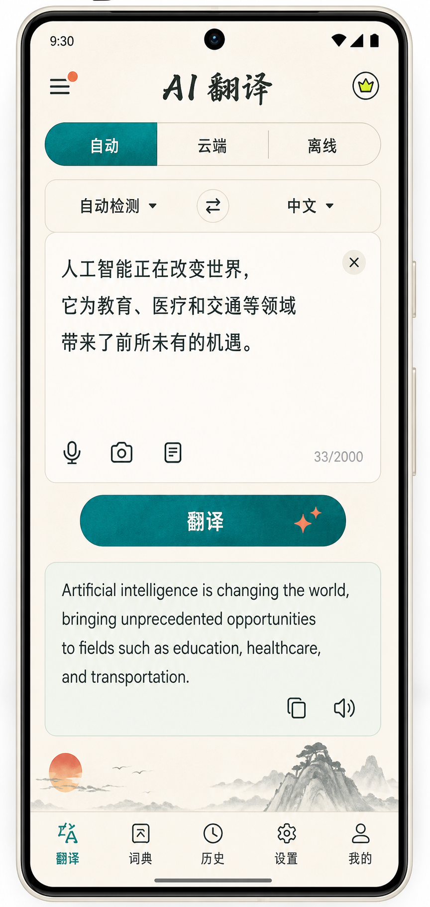
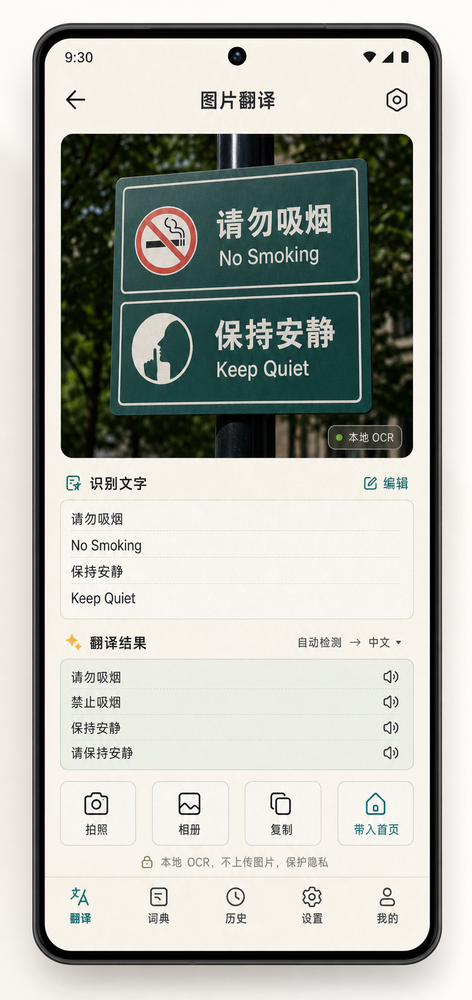
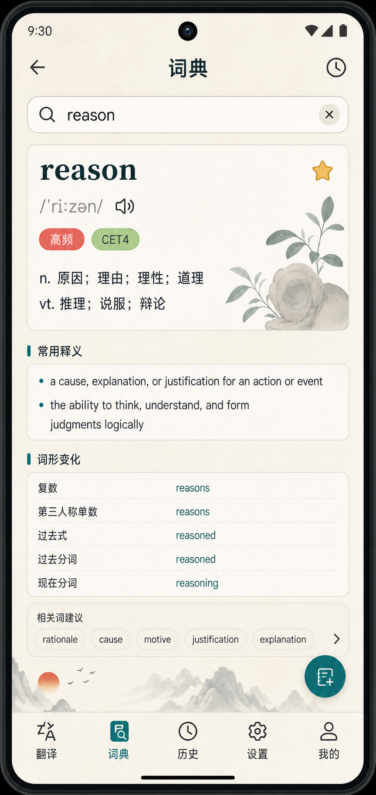
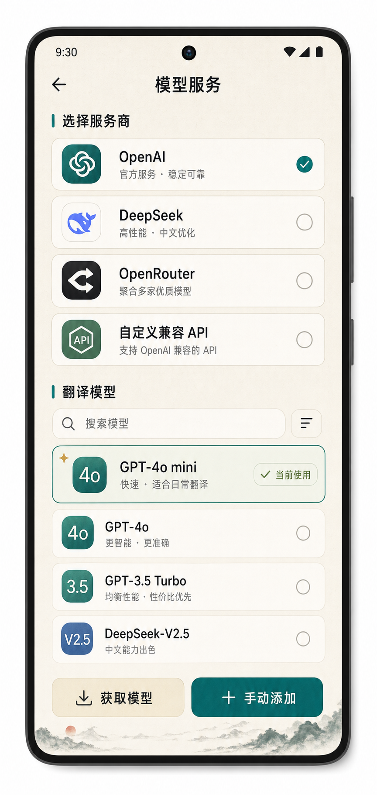
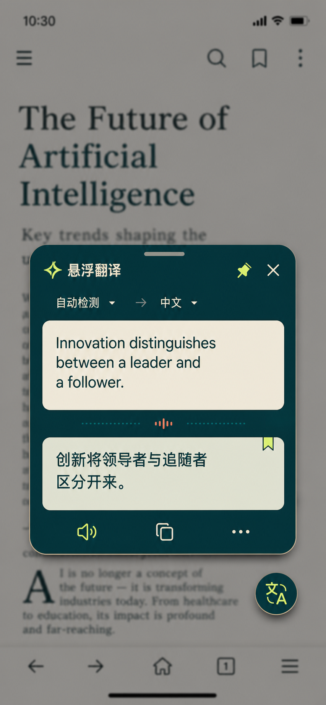

# AI 翻译 App 原型设计交付文档

## 一、基本信息

- 项目名称：AI 翻译 App
- 文档类型：原型设计说明、业务逻辑校验与成员责任承诺
- 项目平台：Android
- 主要技术方向：Kotlin、Jetpack Compose、Material 3、OpenAI 兼容接口、本地离线模型、ML Kit OCR、Room、DataStore
- 原型与视觉工具：AI 初始设计生成、Pixso 手工设计与优化、imagegen 视觉方案生成
- 小组成员：成员 A、成员 B、成员 C
- 文档用途：用于说明本项目原型设计思路、页面逻辑、字段规范、交叉校验和成员分工，作为课程作业交付材料。

## 二、文档目的

原型设计是开发落地的关键。团队需要在开发前交叉校验设计逻辑与界面一致性，避免因设计疏漏导致开发返工。对于 AI 翻译 App 来说，核心模块包括文本翻译、图片翻译、词典、历史记录、模型配置、离线模型、文本朗读和悬浮翻译。任何一个模块的字段、状态或入口不清晰，都会影响用户能否顺利完成翻译任务。

本文件基于当前项目实际功能整理，重点说明 App 的核心使用闭环、页面结构、字段规范、AI 初始设计问题、Pixso 手工优化方向、交叉校验要求以及成员分工与责任承诺。

## 三、项目背景与设计目标

AI 翻译 App 面向日常文本翻译、图片 OCR 翻译、离线查词、跨应用快速翻译和离线模型翻译场景。用户可以输入文本进行云端或离线翻译，也可以通过拍照、相册、剪贴板、系统分享和悬浮窗触发快速翻译。

本次原型设计目标如下：

1. 建立清晰的翻译业务闭环：输入内容、选择语言、选择模型、发起翻译、查看结果、复制或朗读、保存历史。
2. 保证 AI 模型服务配置逻辑清楚，避免 Base URL、API Key、供应商、模型名称等字段混乱。
3. 保证离线模型不内置进 APK，而是通过首次下载方案接入，减少安装包体积。
4. 让文本翻译、图片翻译、词典、历史、设置等页面风格统一，减少跳转和理解成本。
5. 对 AI 初始设计中出现的图层混乱、组件未分组、字段缺失、状态遗漏等问题进行识别与修正。
6. 通过 Pixso 手工优化和小组交叉校验，使原型既好看，也能支持真实业务开发。

## 四、核心功能范围

### 1. 文本翻译首页

文本翻译首页是 App 的核心页面，承担用户最高频的翻译流程。

页面应包含：

- 源语言选择。
- 目标语言选择。
- 语言互换按钮。
- 翻译模型选择入口。
- 原文输入框。
- 字数统计。
- 文本朗读入口。
- 翻译按钮。
- 译文结果区域。
- 复制、朗读、重新翻译等操作。
- 拍照、相册、剪贴板快译等工具入口。

### 2. 图片 OCR 翻译

图片翻译用于支持拍照或相册导入后提取文字并翻译。

页面或流程应包含：

- 拍照入口。
- 相册导入入口。
- OCR 识别状态。
- 识别出的原文。
- 识别失败提示。
- 识别后自动进入翻译或手动确认翻译。
- 译文展示与复制入口。

### 3. 离线词典

离线词典用于查询英文单词，满足无网络场景下的基础查词需求。

页面应包含：

- 搜索框。
- 单词详情。
- 音标。
- 中文释义。
- 英文释义。
- 词性、考试标签、词频和词形变化。
- 未命中提示。
- 相近词建议。

### 4. 历史记录

历史记录用于保存用户已经完成的翻译，方便回看和复用。

页面应包含：

- 原文预览。
- 译文预览。
- 翻译模式标识，例如云端翻译或离线翻译。
- 语言方向。
- 翻译时间。
- 历史详情面板。
- 复制译文。
- 删除单条历史。
- 清空历史入口。

### 5. 设置与 AI 模型服务

设置页用于管理翻译能力和系统能力，是保证 App 可用性的关键页面。

页面应包含：

- AI 模型服务。
- 供应商配置。
- Base URL。
- API Key。
- 当前翻译模型。
- 获取模型。
- 添加自定义模型。
- 离线模型管理。
- 启动默认模型。
- 文本朗读 TTS。
- 系统悬浮窗。
- 网络与性能。
- 数据与历史。
- 关于与系统更新。

## 五、核心原型图展示

以下原型图来自本项目 `docs/ui/` 目录，用于辅助说明主要页面结构和交互方向。文档中只选取关键页面，避免过多图片影响阅读。



图 1：文本翻译首页原型图。该页面体现语言选择、模型选择、原文输入、翻译按钮和译文结果之间的主流程关系。



图 2：图片 OCR 翻译原型图。该页面体现拍照 / 相册导入、文字识别、识别结果确认和翻译结果展示。



图 3：离线词典原型图。该页面体现搜索框、单词详情、音标、释义、标签和相近词建议。



图 4：AI 模型服务原型图。该页面体现供应商配置、模型选择、API 配置和模型状态管理。



图 5：悬浮翻译原型图。该页面体现跨应用悬浮球、迷你翻译窗和轻量操作流程。

## 六、核心业务逻辑

本项目的核心逻辑可以概括为：

```text
配置模型服务 / 准备离线模型 → 输入或识别文本 → 选择语言与模型
→ 发起翻译 → 展示译文 → 复制 / 朗读 / 保存历史 → 后续复用
```

具体说明如下：

1. 用户需要先具备可用翻译能力。云端翻译依赖 Base URL、API Key 和模型名称；离线翻译依赖本地模型文件。
2. 文本翻译必须先有有效输入，空输入不能发起翻译请求。
3. 图片翻译必须先完成 OCR 识别，再将识别文本送入翻译流程。
4. 语言选择需要保持源语言、目标语言和互换操作的一致性。
5. 模型选择需要与实际翻译模式一致，不能界面显示云端模型但实际走离线模式。
6. 翻译结果生成后，需要支持复制、朗读和写入历史记录。
7. 历史详情需要能回溯原文、译文、语言方向、翻译模式和时间。
8. 悬浮翻译和剪贴板快译需要复用同一套翻译逻辑，避免出现主页面能翻译、跨应用入口不能翻译的问题。

## 七、字段与状态规范

### 1. 翻译页字段

- 源语言：必填，默认可为自动检测。
- 目标语言：必填，默认可为中文（简体）。
- 翻译模型：必填，显示当前使用的云端模型或离线模型。
- 原文输入：必填，空白文本不允许提交。
- 字数统计：显示当前输入长度和最大限制。
- 翻译状态：至少包含待输入、可翻译、翻译中、翻译成功、翻译失败。
- 译文结果：翻译成功后展示，支持复制和朗读。

### 2. AI 模型服务字段

- 供应商名称：必填，例如 OpenAI、DeepSeek、OpenRouter 或自定义兼容接口。
- Base URL：必填，用于请求 OpenAI 兼容接口。
- API Key：必填，用于接口鉴权。
- 模型名称：必填，用于具体翻译请求。
- 获取模型状态：包含未获取、获取中、获取成功、获取失败、空列表。
- 自定义模型：支持手动添加并持久化保存。
- 当前选中供应商：用于决定翻译请求使用哪一组配置。

### 3. 离线模型字段

- 模型名称：HY-MT1.5-1.8B-Q4_K_M。
- 模型大小：约 1.13GB。
- 下载状态：未下载、下载中、已下载、下载失败。
- 下载进度：按分片下载进度展示。
- 模型校验：校验文件大小和 SHA256。
- 删除模型：用户确认后删除本地模型文件。

### 4. 历史记录字段

- 原文。
- 译文。
- 源语言。
- 目标语言。
- 翻译模式。
- 翻译时间。
- 历史详情状态。
- 删除状态。

### 5. 图片翻译字段

- 图片来源：拍照或相册。
- OCR 状态：等待识别、识别中、识别成功、识别失败。
- 识别文本。
- 翻译状态。
- 翻译结果。

## 八、AI 初始设计生成与问题识别

AI 初始设计能够快速提供视觉方向，但生成结果不能直接交付，需要人工审查。本项目中需要重点识别以下问题：

- 页面图层可能混乱，多个卡片、按钮、输入框没有清晰分组。
- 翻译页可能只展示输入框和按钮，遗漏模型选择、语言互换、字数统计、朗读和复制等必要状态。
- 设置页可能只堆叠 Base URL、API Key、模型名称，缺少“AI 模型服务”的模块化结构。
- 离线模型页面可能没有体现模型下载状态、文件大小、校验和删除确认。
- 历史记录可能只显示长文本卡片，导致列表被撑开，缺少详情面板。
- 图片翻译可能只展示相机入口，缺少 OCR 识别状态和识别失败提示。
- 悬浮翻译和剪贴板快译可能没有与主翻译流程统一，容易造成入口割裂。

成员 A 需要如实记录以上问题，不隐瞒设计缺陷，并将问题同步给负责 Pixso 优化和文档校验的成员。

## 九、Pixso 手工设计与优化

Pixso 手工优化的目标是把 AI 初稿整理为可开发、可校验、可交付的原型。优化重点如下：

### 1. 首页翻译流程优化

- 将语言选择、模型选择、输入框、翻译按钮和结果卡片按用户操作顺序排列。
- 保证翻译按钮在无输入时有明确禁用状态。
- 将复制、朗读、清空等操作放在用户容易找到的位置。
- 保证文本过长时不会撑坏卡片或遮挡底部导航。

### 2. 设置页模块化优化

- 将模型配置归入“AI 模型服务”，避免输入字段散落在设置页。
- 将供应商配置、翻译模型、离线模型、TTS、悬浮窗、网络性能和系统更新拆成二级页面。
- 保证二级页面返回逻辑统一，减少用户迷路。
- 对 Base URL、API Key、模型名称等关键字段设置明确标签和提示。

### 3. 词典与历史页面优化

- 词典页使用搜索框和单词详情卡片，保证释义信息清楚。
- 未命中时显示相近词建议，而不是只显示空白。
- 历史页使用折叠预览，点击后进入详情面板。
- 删除和复制操作要清楚，不误触。

### 4. 图片与悬浮翻译优化

- 图片翻译流程需要明确拍照、相册、OCR 识别、翻译结果的先后关系。
- 悬浮翻译需要保持小窗轻量，不遮挡用户正在使用的第三方 App。
- 剪贴板快译需要先确认用户意图，再执行翻译，避免打扰。

## 十、交叉校验内容

交叉校验不是只看界面是否美观，而是检查原型是否支撑真实业务流程。

### 1. 翻译闭环校验

- 是否能从输入文本顺利完成翻译。
- 是否能从图片 OCR 识别进入翻译。
- 是否能复制、朗读和保存翻译结果。
- 历史记录是否能回溯完整翻译信息。
- 剪贴板和悬浮翻译是否复用主翻译逻辑。

### 2. 模型配置校验

- Base URL、API Key、模型名称是否都能找到。
- 获取模型失败时是否有明确提示。
- 自定义模型是否能添加并选择。
- 云端模型和离线模型的显示是否与实际翻译模式一致。
- 离线模型未下载时是否阻止离线翻译并提示下载。

### 3. 字段完整性校验

- 翻译页是否包含源语言、目标语言、模型、原文、译文和状态提示。
- 图片翻译是否包含图片来源、OCR 状态和识别文本。
- 历史记录是否包含原文、译文、语言方向、模式和时间。
- 设置页是否包含模型服务、离线模型、TTS、悬浮窗和更新入口。

### 4. 界面一致性校验

- 同类按钮样式是否一致。
- 同类输入框高度、边距和字体是否一致。
- 状态标签颜色和含义是否统一。
- 底部导航是否在各页面保持一致。
- 图层分组是否清晰，是否便于开发落地。

## 十一、成员分工与责任承诺

| 成员 | 核心任务 | 占比 | 责任承诺 |
| --- | --- | --- | --- |
| 成员 A | AI 初始设计生成与问题识别（文本翻译、图片翻译两大核心功能 + 设置配置页） | 30% | 如实记录 AI 图层混乱、组件未分组等问题，不隐瞒语言选择、模型配置、OCR 状态、历史字段缺失等核心缺陷。 |
| 成员 B | Pixso 手工设计与优化（翻译首页布局、设置页模型服务字段规范） | 45% | 严格按“先配置模型服务 / 准备离线模型，再输入或识别文本，最后完成翻译与历史保存”的逻辑设计，确保模型状态标识清晰、翻译字段完整、组件分组有序。 |
| 成员 C | 设计文档整理与交叉校验（翻译业务闭环、模型配置字段关联性） | 25% | 核对设计与项目需求一致性，不遗漏 Base URL、API Key、模型名称、离线模型下载状态、OCR 识别状态、历史保存等关键元素，验证翻译数据与模型配置关联合规。 |

## 十二、成员工作说明

### 成员 A：AI 初始设计生成与问题识别

成员 A 主要负责使用 AI 工具生成初始页面方向，包括文本翻译、图片翻译和设置配置页。生成后需要记录 AI 初稿中的实际问题，例如图层混乱、组件未分组、翻译状态缺失、模型配置字段缺失和跨页面入口不统一。

### 成员 B：Pixso 手工设计与优化

成员 B 主要负责在 Pixso 中进行人工整理和优化。优化重点不是简单美化，而是把页面调整为符合真实 App 使用逻辑的可开发原型，尤其要保证翻译首页布局清晰、设置页模型服务字段规范、离线模型状态明确、组件分组有序。

### 成员 C：设计文档整理与交叉校验

成员 C 主要负责整理设计文档，并从业务逻辑角度进行交叉校验。重点检查翻译输入、模型配置、OCR 识别、译文结果和历史记录之间是否形成闭环，字段命名和页面展示是否一致，关键状态是否遗漏。

## 十三、验收清单

- [x] 已说明原型设计对开发落地的重要性。
- [x] 已基于 AI 翻译 App 项目本身整理文档。
- [x] 已说明文本翻译、图片翻译、词典、历史、设置等核心页面。
- [x] 已加入文本翻译、图片 OCR 翻译、离线词典、AI 模型服务和悬浮翻译原型图。
- [x] 已明确翻译业务闭环。
- [x] 已列出翻译页、模型服务、离线模型、历史记录和图片翻译字段规范。
- [x] 已补充 Base URL、API Key、模型名称等模型配置要求。
- [x] 已补充离线模型下载状态和校验要求。
- [x] 已补充 OCR 识别状态和失败提示。
- [x] 已说明 AI 初始设计中可能存在的问题。
- [x] 已说明 Pixso 手工优化重点。
- [x] 已写入成员分工、占比和责任承诺。
- [x] 已加入交叉校验要求，确保设计与项目需求一致。

## 十四、总结

本次原型设计文档围绕 AI 翻译 App 的真实功能展开，重点解决 AI 初始设计可能存在的字段缺失、图层混乱、组件未分组和业务流程割裂问题。通过 Pixso 手工优化和小组交叉校验，最终形成以翻译为核心、模型配置为基础、历史记录和多入口快译为延展的设计方案。

该方案能够帮助后续开发人员准确理解页面结构和业务逻辑，减少因设计遗漏导致的返工，同时提升用户在文本翻译、图片翻译、离线查词和跨应用翻译场景下的使用效率。
